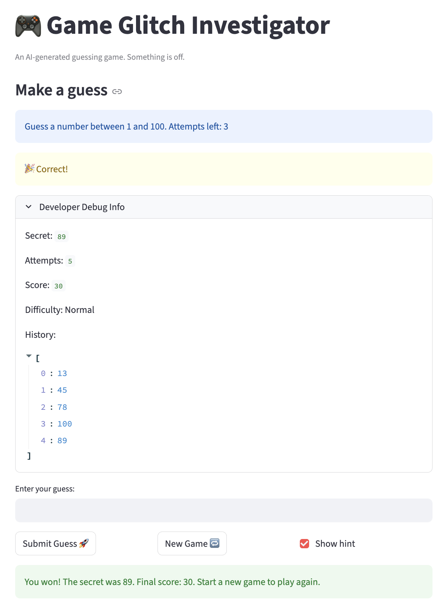

# 🎮 Game Glitch Investigator: The Impossible Guesser

## 🚨 The Situation

You asked an AI to build a simple "Number Guessing Game" using Streamlit.
It wrote the code, ran away, and now the game is unplayable. 

- You can't win.
- The hints lie to you.
- The secret number seems to have commitment issues.

## 🛠️ Setup

1. Install dependencies: `pip install -r requirements.txt`
2. Run the broken app: `python -m streamlit run app.py`

## 🕵️‍♂️ Your Mission

1. **Play the game.** Open the "Developer Debug Info" tab in the app to see the secret number. Try to win.
2. **Find the State Bug.** Why does the secret number change every time you click "Submit"? Ask ChatGPT: *"How do I keep a variable from resetting in Streamlit when I click a button?"*
3. **Fix the Logic.** The hints ("Higher/Lower") are wrong. Fix them.
4. **Refactor & Test.** - Move the logic into `logic_utils.py`.
   - Run `pytest` in your terminal.
   - Keep fixing until all tests pass!

## 📝 Document Your Experience

**Game Purpose:**
A number guessing game where the player tries to guess a secret number within a limited number of attempts. Each difficulty sets a different number range and attempt limit. After each guess, a hint tells you to go higher or lower.

**Bugs Found:**
1. Hint messages were swapped — "Go HIGHER" showed when guess was too high, "Go LOWER" when too low.
2. Invalid input (empty or non-numeric) consumed an attempt.
3. New Game button only reset the secret number — status, history, score, and attempts were not reset, making the game unplayable after a win/loss.
4. Changing difficulty did not reset game state or update the number range and attempts left.
5. The info message hardcoded "1 to 100" regardless of difficulty.
6. Attempts left was off by one — `attempts` was initialized to `1` instead of `0`.
7. After submitting a guess, the attempts count, history, and hint did not update immediately due to Streamlit's top-down render order.
8. The guess input field retained the previous value after submitting.

**Fixes Applied:**
1. Swapped the hint messages in `check_guess` in `logic_utils.py`.
2. Moved `attempts += 1` inside the valid-guess branch so invalid input is skipped.
3. Reset all session state (`status`, `history`, `score`, `attempts`, `secret`) in the new game block.
4. Added difficulty-change detection that resets all game state when difficulty switches.
5. Replaced hardcoded `"1 and 100"` with `f"{low} and {high}"` using values from `get_range_for_difficulty`.
6. Changed `attempts` initialization and all resets from `1` to `0`.
7. Stored hint in `session_state` and called `st.rerun()` after each submit so UI renders with updated state.
8. Added `game_id` counter to the text input key and incremented it on every submit to force the field to clear.

## 📸 Demo

- 

## 🚀 Stretch Features

- [ ] [If you choose to complete Challenge 4, insert a screenshot of your Enhanced Game UI here]
